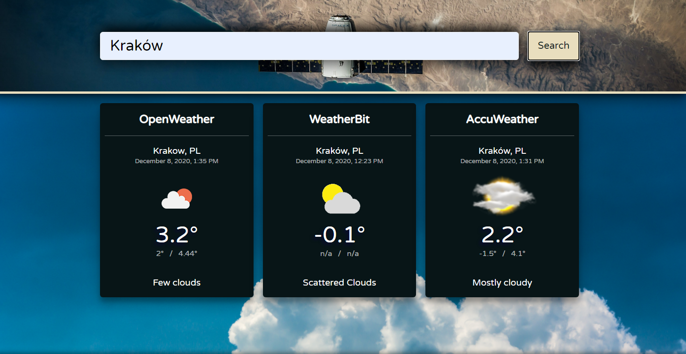

# Weather-Check

<h2>About app:</h2> 
Weather-Check is little Node.js application that check weather from three API sources: OpenWeather, WeatherBit, AccuWeather. Part of application was created by CodersLab but my task was to finish it. Technology used is: Javascript, ES6, Express.js, Lodash, CSS,  lit-html, nodemon, node-fetch
<h2>Setup on your machine (requirements : installed Node.js, get your api keys from each sources and put it into .env file) </h2>
1. Clone repository, 
2. On your terminal use commend: npm i, 
3. and then: npm start
